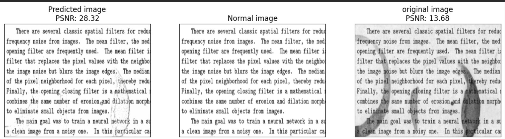

# Image Denoising using Autoencoder

This project aims to implement an image denoising technique using an autoencoder. The autoencoder is a type of neural network that is trained to reconstruct clean images from noisy inputs. By training the autoencoder on a [dataset](https://drive.google.com/file/d/1-H1BGhkA1jMUzmWpOMuoA5_NiGL9BOcY/view?usp=sharing) of noisy and clean images, it learns to remove the noise and produce denoised images.

## Prerequisites

Before running the code, make sure you have the following dependencies installed:

- Python
- Keras
- NumPy
- Matplotlib

## Examples

